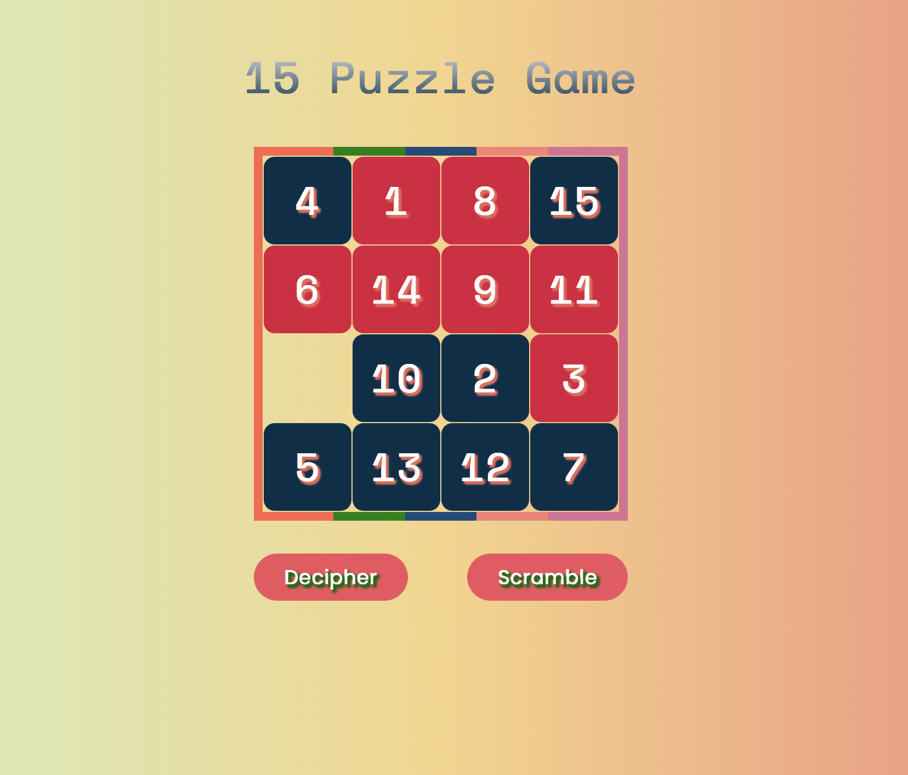
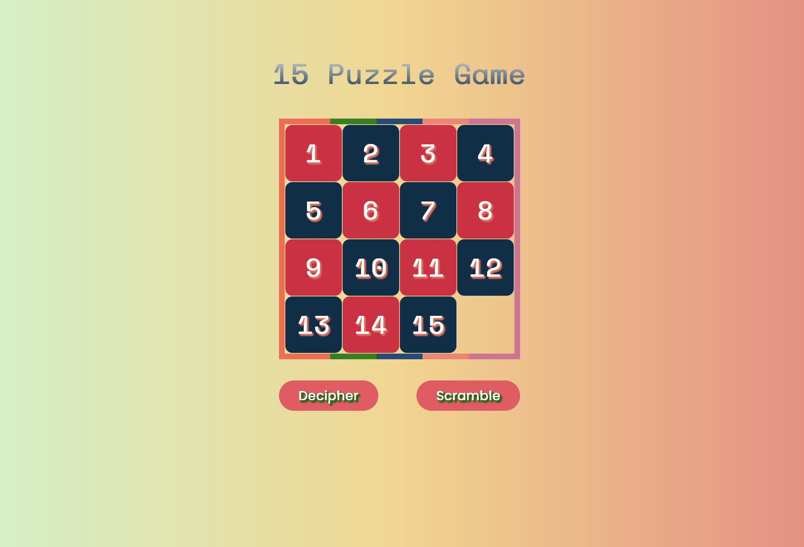

# 🧩 15-Puzzle-Game

<div align="center">
  


**A classic sliding puzzle game built with vanilla web technologies** 🎮

[🎯 Play Now](#installation) • [📖 Rules](#usage) • [🤝 Contribute](#contributing)

</div>

---

## 🎯 Project Overview

Welcome to the **15-Puzzle-Game**! This is a classic sliding puzzle game that challenges your problem-solving skills. The objective is simple yet engaging: arrange the numbered tiles from 1 to 15 in ascending order by sliding them into the empty space.

### ✨ Features

- 🎮 **Interactive Gameplay** - Click tiles adjacent to the empty space to move them
- 🔀 **Scramble Function** - Randomly shuffle tiles to start a new challenge
- 🎯 **Decipher Mode** - Auto-arrange tiles in correct order
- 📱 **Responsive Design** - Works seamlessly across all device sizes
- 🎨 **Custom Animations** - Smooth tile transitions and button effects
- 🎭 **Beautiful UI** - Gradient backgrounds with custom typography
- ❓ **Interactive Rules** - Built-in help modal for game instructions

### 🛠️ Technologies Used

| Technology | Purpose |
|------------|---------|
|  | Structure and layout |
|  | Styling and animations |
|  | Game logic and interactivity |

---

## 📁 Directory Structure

```
15-Puzzle-Game/
├── 📄 index.html
├── 📖 README.md
├── 📜 LICENSE
├── 📁 css/
│   ├── 🎨 stylesheet.css
│   └── 📁 fonts/
│       ├── 🔤 poppins.ttf
│       └── 🔤 space-mono.ttf
├── 📁 js/
│   └── ⚙️ index.js
└── 📁 images/
    └── 🎯 favicon.png

```

---

## 🚀 Installation

### Quick Start

1. **📥 Clone the repository**
   ```bash
   git clone https://github.com/yourusername/15-Puzzle-Game.git
   ```

2. **📂 Navigate to project directory**
   ```bash
   cd 15-Puzzle-Game
   ```

3. **🌐 Launch the game**
   ```bash
   # Simply open index.html in your browser
   open index.html
   # OR double-click the index.html file
   ```

### 🎮 Alternative: Play Online
> Host it on GitHub Pages, Netlify, or Vercel for instant access!

---

## 🎯 Usage

### 🎮 How to Play

| Action | Description |
|--------|-------------|
| **🎯 Decipher** | Automatically arrange tiles in correct order (1-15) |
| **🔀 Scramble** | Randomly shuffle tiles to start a new game |
| **🖱️ Move Tiles** | Click any tile adjacent to the empty space |
| **❓ Rules** | Click the "?" button to view detailed game instructions |

### 🏆 Objective
Arrange all numbered tiles from **1 to 15** in ascending order with the empty space in the bottom-right corner.

### 💡 Tips
- 🧠 Think ahead before making moves
- 🔄 Use the scramble function for new challenges
- 📱 Game works great on mobile devices too!

---

## 🎨 Screenshots

<div align="center">

| Scrambled State | Solved State |
|----------------|-------------|
|  |  |
| *🔀 Challenge yourself with the scrambled puzzle!* | *🎉 Victory! All tiles in perfect order.* |

</div>

---

## 🤝 Contributing

We welcome contributions! Here's how you can help improve the 15-Puzzle-Game:

### 📝 Steps to Contribute

1. **🍴 Fork the repository**
   ```bash
   # Click the 'Fork' button on GitHub
   ```

2. **🌿 Create a feature branch**
   ```bash
   git checkout -b feature/amazing-feature
   ```

3. **💻 Make your changes**
   ```bash
   # Add your improvements
   git add .
   git commit -m "✨ Add amazing feature"
   ```

4. **🚀 Push to your branch**
   ```bash
   git push origin feature/amazing-feature
   ```

5. **🔄 Open a Pull Request**
   - Go to GitHub and create a Pull Request
   - Describe your changes clearly

### 🎯 Contribution Ideas

- 🎵 Add sound effects
- 🏅 Implement scoring system
- ⏱️ Add timer functionality
- 🎨 Create new themes
- 📊 Add statistics tracking
- 🌍 Implement internationalization

---

